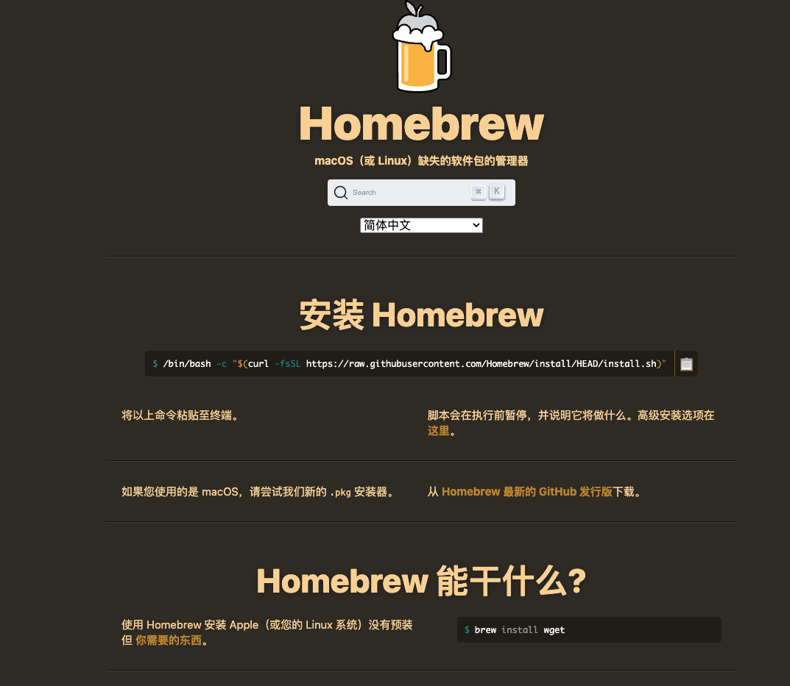
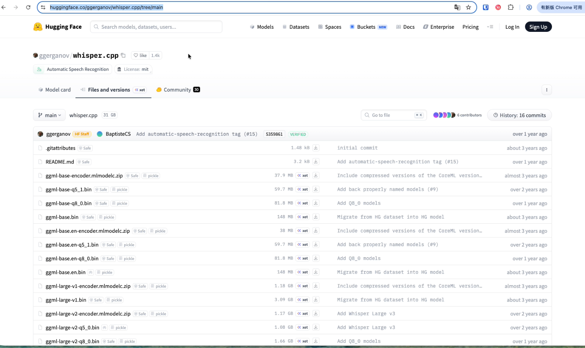
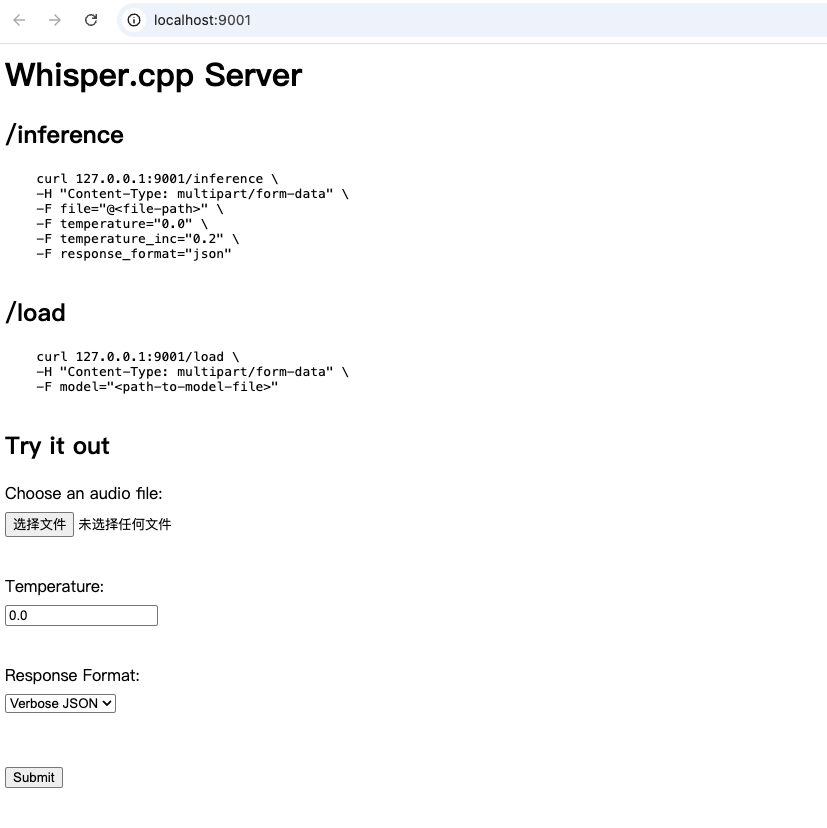
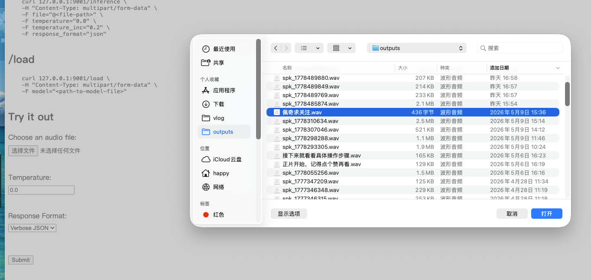

# 在 macOS 上安装 Whisper 进行语音识别

## 第一步：安装 Homebrew

Homebrew 是一个开源的软件包管理工具，非常适合在 macOS 系统上使用。

> 如果您已经安装了 Homebrew，可以跳过此步骤。

### 安装过程

1. 访问 [Homebrew 官网](https://brew.sh/)
2. 复制官网提供的安装命令
3. 粘贴到终端中并回车执行



安装前系统会向您确认安装内容，再次回车即可开始安装。

> **注意**：下载过程可能比较耗时，请耐心等待。

### 配置环境变量

安装完成后，您需要配置环境变量，否则执行命令时可能会报错。

配置环境变量很简单，只需执行终端提示的脚本命令即可：

```bash
# 示例命令，请以官网最新提示为准
eval "$(/opt/homebrew/bin/brew shellenv)"
```

执行完成后，您就可以正常使用 brew 命令了。

> 成功完成此步骤后，整个安装过程就完成了一大半。

## 第二步：下载 Whisper 的语音模型

官方提供了 tiny、base、small、medium、large 五种不同规格的语音模型。

| 模型 | 适用场景 | 特点 |
|------|----------|------|
| tiny | 快速测试 | 最小 |
| base | 一般用途 | 小巧 |
| small | 一般用途 | 推荐 |
| medium | 高精度需求 | 较大 |
| large | 最高精度 | 最大 |

对于一般用途，推荐选择 **small** 模型。虽然只有几百 MB，但中文识别准确度很高。

### 下载模型

1. 访问 Whisper 模型下载页面 (例如 [huggingface.co/ggerganov/whisper.cpp](https://huggingface.co/ggerganov/whisper.cpp))
2. 找到 `ggml-small.bin` 文件
3. 点击下载



下载完成后，请将模型文件保存在一个容易访问的目录中备用。

## 第三步：安装 Whisper

由于我们之前安装了 Homebrew，现在只需执行以下命令即可完成安装：

```bash
brew install whisper
```

> **注意**：安装过程中可能会出现网络问题，可以重试或尝试使用代理。

## 如何使用 Whisper

Whisper 官方提供了多种使用方式，下面介绍一种最简单的用法：**whisper-server**。

### 启动 Whisper Server

whisper-server 是官方自带的可视化界面，可以直接在浏览器中打开，操作方便。

执行以下命令启动服务：

```bash
whisper-server --model /path/to/ggml-small.bin
```

> **重要**：请将命令中的 `/path/to/ggml-small.bin` 替换为您在第二步中下载的语音模型文件的实际路径。

例如，如果您的模型文件保存在 Downloads 文件夹中：

```bash
whisper-server --model ~/Downloads/ggml-small.bin
```

### 使用界面

命令执行成功后，服务会监听端口 **9001**。

在浏览器中打开 `http://localhost:9001` 即可看到界面。



界面非常简洁，您需要做的所有事情包括：

1. 选择一个语音文件
2. 选择需要的文件输出格式
3. 点击 **Submit** 按钮

### 输出格式选项

Whisper 支持多种输出格式：

- **TXT** - 纯文本格式
- **VTT** - WebVTT 字幕格式
- **SRT** - 标准字幕格式
- **JSON** - JSON 格式
- **CSV** - CSV 表格格式

## 实际应用示例

让我们用一个音频文件演示整个使用过程。

### 准备工作

1. 准备要转录的音频文件
2. 启动 whisper-server
3. 访问 `http://localhost:9001`

### 操作流程

1. 在界面上选择音频文件
2. 选择输出格式（例如 SRT）
3. 点击 Submit



### 结果验证

- 识别准确性通常很高
- 处理速度快
- 支持多种音频格式

### 与视频编辑软件结合

生成的字幕文件可以导入到各种视频编辑软件中，例如剪映：

1. 导出 SRT 字幕文件
2. 打开视频编辑软件（如剪映）
3. 导入音频文件
4. 导入生成的字幕文件
5. 调整字幕样式和位置


## 总结

这种使用 Whisper 生成字幕的方法具有以下优点：

- **免费**：无需付费使用
- **准确**：中文识别准确率高
- **灵活**：支持多种输出格式
- **高效**：处理速度快

这种方式完美解决了普通用户自动生成字幕的需求。如果您觉得这个方法有用，请点赞关注我，我会持续分享更多实用技巧。

## 常见问题

### Q: 安装过程中遇到网络问题怎么办？

A: 可以尝试重试，或使用网络加速工具。

### Q: 模型文件应该选择哪个？

A: 对于一般用途，推荐 small 模型；对精度要求高可选择 medium 或 large。

### Q: 如何提高识别准确度？

A: 选择更大的模型，或对原始音频进行降噪处理。