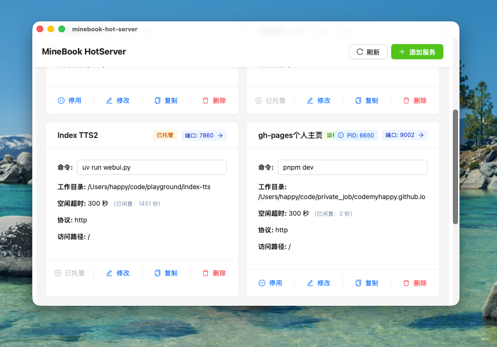

# MineBook Hot Server：我的本地服务管理工具

给自己开发了一个APP **MineBook Hot Server** —— 本地服务管理工具。

## 关于我

大家好，我是博主，要一直开心啊！本职程序员，喜欢捣鼓一些小玩具。大家关注我一波，谢谢大家！

今天要介绍的是我自己开发的一个小工具，我叫它 **MineBook Hot Server**。

## 问题背景

在日常开发过程中，我经常遇到以下问题：

- 本地服务端口被占用，却不知道是哪个进程在作怪
- 偶尔打开的服务端口用完之后总是忘了关闭
- 这会导致电脑的内存压力一直比较高
- 久而久之，电脑就会因为内存不够而卡顿
- 内存不够时，MacBook 就会调用硬盘做交换，从而影响硬盘的寿命

## 解决方案

**MineBook Hot Server** 就是为了解决这些问题而生的，专门解决这种丢三落四的毛病。

它可以：
- 让电脑始终能保留充足的内存
- 让内存能专注于当前正在干的事情
- 告别卡顿

## 操作流程

### 启动服务

通常开发时，我们会通过命令行启动服务端口，比如：

- 一个 8888 端口
- 一个 9999 端口

但这种方式的问题就是要启动控制台，然后很容易忘记关闭这两个端口，从而造成它们一直占用内存。

### 使用 MineBook Hot Server

现在我们就不通过命令行来启动它们了：

1. 在我开发的 **MineBook Server App** 里点击"添加服务"
2. 配置启动命令就行了
3. 保存配置后 APP 会自动托管这个端口
4. 你不用再去控制台启动服务端口了，直接点击前往访问即可

### 自动管理闲置端口

对于 APP 闲置的处理逻辑是这样的：

- APP 会自动检查端口的流量，从而判断服务是否活跃
- 不活跃的服务端口会在指定的时间内自动关闭
- 比如这里的 9999 端口，我设置的闲置时间是 30 秒
- 只要超过 30 秒没有流量，这个服务就会自动关闭

## 总结

整个 APP 的核心操作流程就完成了，操作流程够简单了吧！

这个 APP 我已经使用了一段时间了，整体来说还是很方便的：

- 既兼顾了内存占用
- 还能查看我到底有哪些本地端口
- 因为是 RAS 开发的，稳定性也还可以

其他附加功能我目前还在开发中，有需要的朋友可以关注我，我发给大家试用。

谢谢大家的观看，记得点个关注！