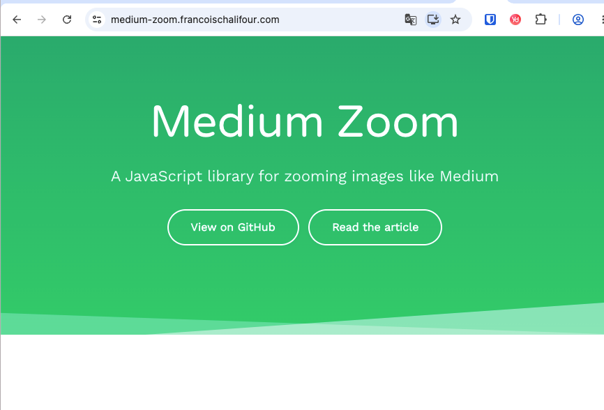

# 利用github的pages服务搭建个人主页第三篇-giscus评论组件和图片预览

上一篇文章[利用github的pages服务搭建个人主页第二篇-主题配置](https://www.codemyhappy.com/blog/利用github的pages服务搭建个人主页第二篇-主题配置)，教大家美化了主页的样式。

这一篇文章介绍如何使用giscus组件来添加评论功能，并且添加图片预览功能。

## 评论功能

### 原理

giscus 加载时，会使用 GitHub Discussions 搜索 API 根据选定的映射方式（如 URL、pathname、title等）来查找与当前页面关联的 discussion。如果找不到匹配的 discussion，giscus bot 就会在第一次有人留下评论或回应时自动创建一个 discussion。

### 第一步：找到giscus的官网

官网地址： [https://giscus.app/zh-CN](https://giscus.app/zh-CN)

按照giscus官网的步骤，配置项目仓库就行了。

它还贴心的有一个检测功能，能检测你的项目仓库是否满足要求。


### 第二步：在本项目中集成giscus

官方默认的方式是使用script标签引入giscus。


并且我试用了一下官方的vue库，并不能适配我的这个项目。

于是就自己写了个组件，如下：

```vue
<script setup>
// .vitepress/theme/GiscusComment.js
import { onMounted, ref } from 'vue';

const commentState = ref(1)

onMounted(()=>{
  const script = document.createElement('script');
  script.src = 'https://giscus.app/client.js';
  script.async = true;
  script.crossOrigin = 'anonymous';
  script.setAttribute('data-repo', 'codemyhappy/codemyhappy.github.io');
  script.setAttribute('data-repo-id', 'R_kgDOIr5QXA');
  script.setAttribute('data-category', 'Announcements');
  script.setAttribute('data-category-id', 'DIC_kwDOIr5QXM4C_T_S');
  script.setAttribute('data-mapping', 'pathname');
  script.setAttribute('data-strict', '0');
  script.setAttribute('data-reactions-enabled', '1');
  script.setAttribute('data-emit-metadata', '0');
  script.setAttribute('data-input-position', 'top');
  script.setAttribute('data-theme', 'preferred_color_scheme');
  script.setAttribute('data-lang', 'zh-CN');
  document.getElementById('code-my-happy-giscus-comment').appendChild(script);
  script.onload = function () {
    console.log('giscus loaded');
    commentState.value = 3;
  };
  script.onerror = function () {
    commentState.value = 2;
  };
})

</script>

<template>
  <div>
      {{ commentState===1 ? '评论加载中...' : '' }}
      {{ commentState===2 ? '评论组件加载失败，刷新重试一下吧' : '' }}
      <div id="code-my-happy-giscus-comment"></div>
  </div>
</template>
```

然后，插入到theme的文章底部就行了。

```js
// .vitepress/theme/index.js
import { h } from 'vue'
import DefaultTheme from 'vitepress/theme'
import GiscusComment from './GiscusComment.vue'

export default {
  extends: DefaultTheme,
  Layout() {
    return h(DefaultTheme.Layout, null, {
        // 将组件插入到文章的底部
      'doc-after': () => h(GiscusComment)
    })
  }
}
```

### 最后，测试评论一下


至此，大功告成！评论组件就做好了。

想看源码的朋友自己去看吧！

源码位置：[GiscusComment.vue](https://github.com/codemyhappy/codemyhappy.github.io/blob/main/.vitepress/theme/GiscusComment.vue)


## 图片预览功能

图片预览功能，我看了几个库，选了一个最轻量级的`medium-zoom`，gzip大小只有3KB！

它的体验非常丝滑，自己去它的官网体验吧。

https://medium-zoom.francoischalifour.com/



接入步骤也很简单，基本跟着官网的步骤，安装和配置就行了。

### 第一步：安装medium-zoom
```bash
pnpm install medium-zoom
```

### 第二步：封装个空组件

空组件的作用就是放到文档最底部，这样图片加载完成之后，就可以触发图片预览功能了。

```vue
<script setup>
// file: .vitepress/theme/ImagePreview.vue
import mediumZoom from 'medium-zoom'
import { onMounted } from 'vue';

onMounted(() => {
  mediumZoom('img',{
    background: '#000',
    container: document.body,
  })
})
</script>

<template>

</template>

<style>
.medium-zoom-overlay{
    z-index: 9999999;
}
.medium-zoom-image--opened{
    z-index: 99999999;
}

.content img{
    box-shadow:  1px 1px 6px rgba(0,0,0,.2), -1px -1px 6px rgba(0,0,0,.2);
    border-radius: 8px;
    max-width: 400px;
    margin: 0 auto;
}
</style>
```

里面有些CSS样式，是为了增加图片的体验的。加了些阴影、改了层级，其他没动。

### 第三步：在theme的index.js中引入

新建一个容器组件，把评论组件和图片预览组件，两个都插入到容器组件中。

```vue
<script setup>
// file: .vitepress/theme/CodeMyHappyTheme.vue
import GiscusComment from './GiscusComment.vue';
import ImagePreview from './ImagePreview.vue';
</script>

<template>
    <ImagePreview/>
    <GiscusComment/>
</template>
```

最后引入到index.js中
```js
// file: .vitepress/theme/index.js
import { h } from 'vue'
import DefaultTheme from 'vitepress/theme'
import CodyMyHappyTheme from './CodyMyHappyTheme.vue'

export default {
  extends: DefaultTheme,
  Layout() {
    return h(DefaultTheme.Layout, null, {
      'doc-after': () => h(CodyMyHappyTheme)
    })
  }
}
```

整个配置就完成了！
简单测试一下吧。

下面这张图是个测试图片，点它就可以预览啦！


至此，图片预览功能也完成了！

想看源码的朋友自己去看吧！

源码位置：[ImagePreview.vue](https://github.com/codemyhappy/codemyhappy.github.io/blob/main/.vitepress/theme/ImagePreview.vue)

## 总结

本篇是利用github的pages服务搭建个人主页的完结篇。

加入了图片预览功能和评论功能。

**回顾整个流程，总共就三篇：**

- 第一篇，教大家开通了GitHub Pages，能访问到自己的主页。[去查看->](https://codemyhappy.github.io/blog/%E5%A6%82%E4%BD%95%E5%88%A9%E7%94%A8github%E7%9A%84pages%E6%9C%8D%E5%8A%A1%E6%90%AD%E5%BB%BA%E4%B8%80%E4%B8%AA%E4%B8%AA%E4%BA%BA%E4%B8%BB%E9%A1%B5.html)

- 第二篇，教大家如何美化自己的主页。 [去查看->](https://codemyhappy.github.io/blog/%E5%A6%82%E4%BD%95%E5%88%A9%E7%94%A8github%E7%9A%84pages%E6%9C%8D%E5%8A%A1%E6%90%AD%E5%BB%BA%E4%B8%80%E4%B8%AA%E4%B8%AA%E4%BA%BA%E4%B8%BB%E9%A1%B5%E7%AC%AC%E4%BA%8C%E7%AF%87-%E7%BE%8E%E5%8C%96%E7%AF%87.html)

- 第三篇，教大家如何添加评论功能和图片预览功能。[去查看->](https://codemyhappy.github.io/blog/%E5%88%A9%E7%94%A8github%E7%9A%84pages%E6%9C%8D%E5%8A%A1%E6%90%AD%E5%BB%BA%E4%B8%AA%E4%BA%BA%E4%B8%BB%E9%A1%B5%E7%AC%AC%E4%B8%89%E7%AF%87-%E8%AF%84%E8%AE%BA%E5%92%8C%E5%9B%BE%E7%89%87%E9%A2%84%E8%A7%88%E7%AF%87.html)

目前这些对于我来说就够用了。

如果大家还有其他需要的功能，可以在评论区进行许愿，我会尽快添加的。

