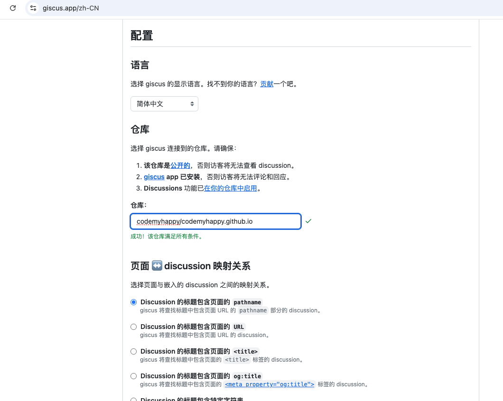
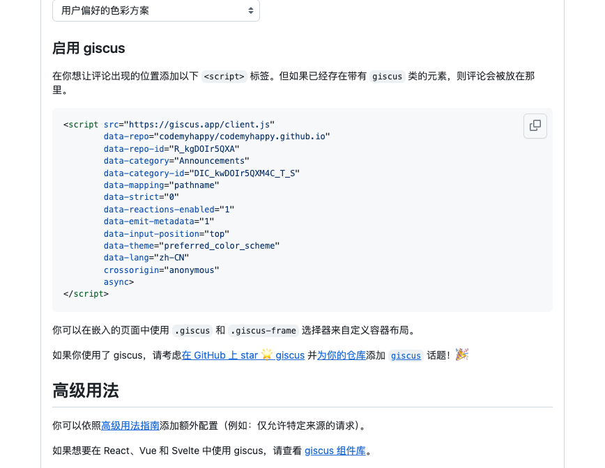

# 利用github的pages服务搭建个人主页第三篇-giscus评论组件和图片预览

## 评论功能

### 原理

giscus 加载时，会使用 GitHub Discussions 搜索 API 根据选定的映射方式（如 URL、pathname、title等）来查找与当前页面关联的 discussion。如果找不到匹配的 discussion，giscus bot 就会在第一次有人留下评论或回应时自动创建一个 discussion。

### 第一步：找到giscus的官网

官网地址： [https://giscus.app/zh-CN](https://giscus.app/zh-CN)

按照giscus官网的步骤，配置项目仓库就行了。

它还贴心的有一个检测功能，能检测你的项目仓库是否满足要求。



### 第二步：在本项目中集成giscus

官方默认的方式是使用script标签引入giscus。



并且我试用了一下官方的vue库，并不能适配我的这个项目。

于是就自己写了个组件，如下：

```vue
<script setup>
// .vitepress/theme/GiscusComment.js
import { onMounted, ref } from 'vue';

const commentState = ref(1)

onMounted(()=>{
  const script = document.createElement('script');
  script.src = 'https://giscus.app/client.js';
  script.async = true;
  script.crossOrigin = 'anonymous';
  script.setAttribute('data-repo', 'codemyhappy/codemyhappy.github.io');
  script.setAttribute('data-repo-id', 'R_kgDOIr5QXA');
  script.setAttribute('data-category', 'Announcements');
  script.setAttribute('data-category-id', 'DIC_kwDOIr5QXM4C_T_S');
  script.setAttribute('data-mapping', 'pathname');
  script.setAttribute('data-strict', '0');
  script.setAttribute('data-reactions-enabled', '1');
  script.setAttribute('data-emit-metadata', '0');
  script.setAttribute('data-input-position', 'top');
  script.setAttribute('data-theme', 'preferred_color_scheme');
  script.setAttribute('data-lang', 'zh-CN');
  document.getElementById('code-my-happy-giscus-comment').appendChild(script);
  script.onload = function () {
    console.log('giscus loaded');
    commentState.value = 3;
  };
  script.onerror = function () {
    commentState.value = 2;
  };
})

</script>

<template>
  <div>
      {{ commentState===1 ? '评论加载中...' : '' }}
      {{ commentState===2 ? '评论组件加载失败，刷新重试一下吧' : '' }}
      <div id="code-my-happy-giscus-comment"></div>
  </div>
</template>
```

然后，插入到theme的文章底部就行了。

```js
// .vitepress/theme/index.js
import { h } from 'vue'
import DefaultTheme from 'vitepress/theme'
import GiscusComment from './GiscusComment.vue'

export default {
  extends: DefaultTheme,
  Layout() {
    return h(DefaultTheme.Layout, null, {
        // 将组件插入到文章的底部
      'doc-after': () => h(GiscusComment)
    })
  }
}
```

### 最后，测试评论一下


至此，大功告成！评论组件就做好了。

想看源码的朋友自己去看吧！

源码位置：[https://github.com/codemyhappy/codemyhappy.github.io](https://github.com/codemyhappy/codemyhappy.github.io)