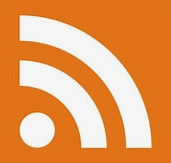
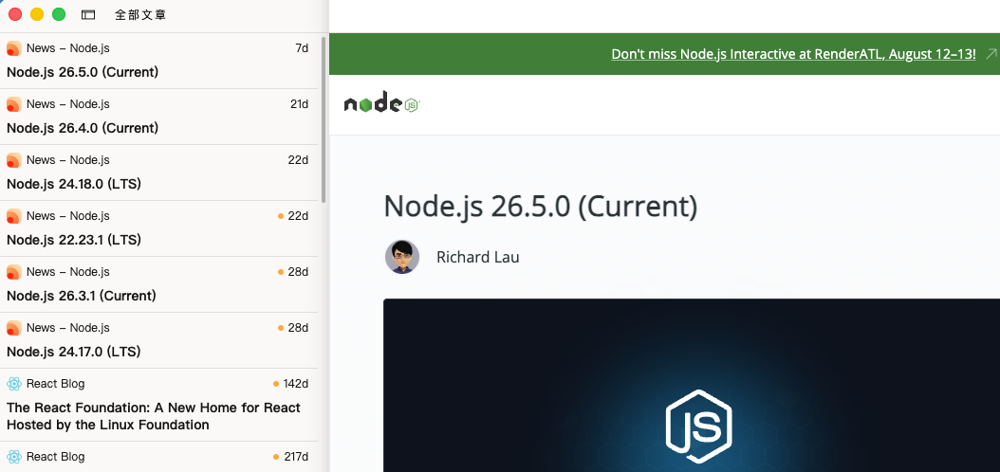
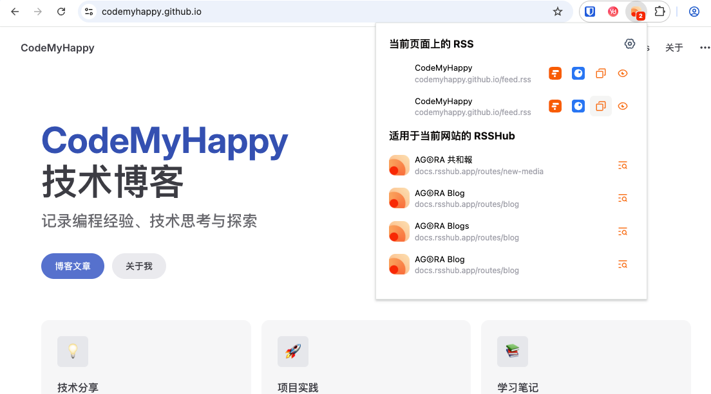
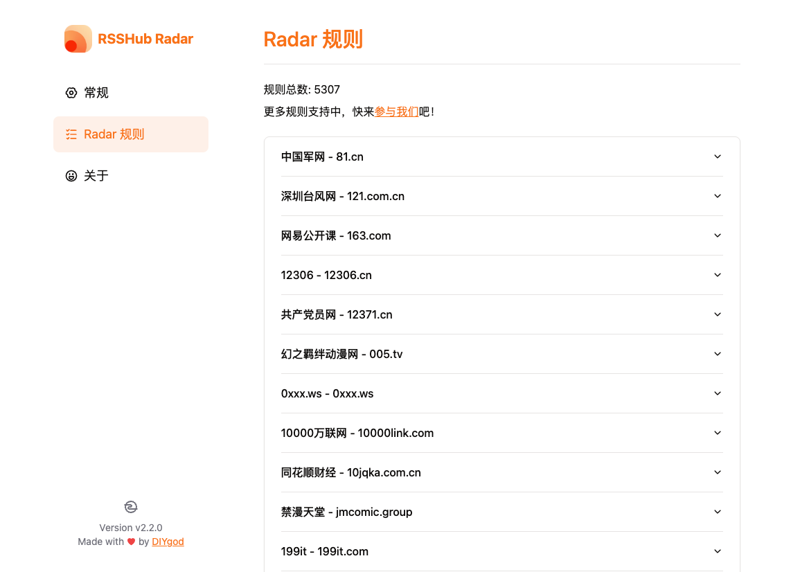

# 好多网站里面都有一个叫订阅的东西，RSS它到底是什么？

经常逛技术博客或者新闻网站的朋友，一定见过一个叫 **订阅** 的功能，旁边通常还配着一个小图标 —— 一个橙色的圆点，向外发射出白色的波浪线。这就是 RSS 订阅的标志。



皮一下~图标有点像个WiFi

但说实话，现在很多人看到"订阅"两个字，第一反应是"关注公众号"或者"点个关注"，压根不知道这个古老的订阅到底是什么东西。今天就来聊聊它。

## 什么是订阅（RSS）？

RSS 的全称是 **Really Simple Syndication**（真正简单的聚合），也叫 **Feed**（源、馈送）。它是一种**内容分发格式**。

简单说，它就是把网站上的内容（文章、新闻、播客等）用一种标准化的、机器可读的格式（通常是 XML）整理出来。你不需要打开这个网站，就能通过一个**阅读器**获取它最新的内容。

举个例子：

- 你关注了 20 个技术博客
- 正常情况：每天早上打开这 20 个网站看看有没有更新，没有就关掉，费时费力
- 用了 RSS 订阅：打开你的阅读器，所有博客的最新文章全都列在一起，像刷邮件一样

**本质就是：网站主动"推"内容，你被动"收"内容，而不需要你主动去"拉"。**

## 和"关注公众号"有什么区别？

这是一个很常见的混淆点。区别很大：

| 特性 | RSS 订阅 | 公众号/社交媒体关注 |
|------|---------|-----------------|
| 内容控制权 | 完全在你手里 | 平台算法决定你能看到什么 |
| 广告 | 基本没有 | 穿插广告、推荐 |
| 独立性 | 独立于任何平台 | 依赖特定平台 |
| 数据隐私 | 不需要注册、不需要个人信息 | 平台知道你的所有行为 |
| 信息完整性 | 能看到所有内容 | 经常被限流、折叠 |
| 运营方控制力 | 网站无法控制你 | 随时可能封号、限流 |

简单一句话：**RSS 订阅是你主动管理信息，平台关注是平台管理你。**

## 如何使用 RSS 订阅？

使用 RSS 很简单，分三步：



### 第一步：找一个 RSS 阅读器

RSS 阅读器就是用来聚合你订阅内容的地方。常见的：

- **在线服务**：Feedly、Inoreader（跨平台同步）
- **桌面客户端**：NetNewsWire（Mac）、Fluent Reader（全平台）
- **命令行工具**：Newsboat（极客专用）
- **浏览器插件**：Feedbro（直接在浏览器里看）

我个人用 Feedly，免费版足够用，所有设备同步。

### 第二步：找到网站的 RSS 订阅地址

找 RSS 地址通常有几种方法：

1. 在网站上找 RSS 图标（橙色小图标），点击就得到地址
2. 直接在网址后面加上 `/feed`、`/rss`、`/atom.xml`，比如 `codemyhappy.github.io/feed`
3. 浏览器地址栏右侧出现 RSS 图标时点击
4. 使用浏览器插件自动检测



拿到地址后复制，在你的阅读器里点击"添加订阅"，粘贴进去就行了。

### 如果网站不提供 RSS 怎么办？

很多网站（尤其是国内的）已经不提供 RSS 订阅了。但这不代表你就没办法了，有几个曲线救国的方案：

**方案一：用 RSSHub**

[RSSHub](https://rsshub.app/) 是一个开源项目，口号是"万物皆可 RSS"。它能把各种不提供 RSS 的网站转成 RSS 源。比如你想订阅某个微博博主、B站 UP 主、知乎专栏、小红书用户，RSSHub 都能生成对应的 RSS 地址。



用法很简单：`https://rsshub.app/平台/用户ID`。比如订阅 B站 UP 主就是 `https://rsshub.app/bilibili/user/video/UID`。RSSHub 支持的网站列表非常长，几乎覆盖了主流平台。

你也可以自己部署 RSSHub 实例，避免依赖公共服务。

**方案二：用 Huginn 自己抓**

[Huginn](https://github.com/huginn/huginn) 是一个开源的事件聚合系统，你可以把它理解成"你的私人 IFTTT"。它能定时抓取网页内容，检测到更新后生成 RSS 源。配置稍微复杂一些，但灵活性极高，什么网站都能抓。

**方案三：用浏览器插件生成**

有一些浏览器插件（如 **Distill Web Monitor**、**Page Monitor**）可以监控网页变化。当页面有更新时，插件会通知你。虽然不是标准的 RSS，但效果类似 —— 你不需要自己反复去刷网站。

**方案四：用第三方转换服务**

像 **FetchRSS**、**Feedity** 这类服务，你输入一个网页地址，它们会自动分析页面结构，生成一个 RSS 源。免费版通常有限制，但轻度使用够了。

**方案五：关注网站的 Newsletter**

有些网站虽然不提供 RSS，但提供邮件订阅（Newsletter）。虽然不如 RSS 自由，但至少你不用主动去刷。可以用临时邮箱订阅，避免垃圾邮件。

总的来说，**RSS 是一种精神，不是一种技术限制**。只要你想把信息控制权拿回自己手里，总有办法绕过那些不提供 RSS 的网站。

### 第三步：日常使用

每天早上打开阅读器，所有你关注的内容按时间排好，看完了标记已读，仅此而已。没有算法推荐、没有广告植入、不用担心错过什么。

## 订阅的格式有哪些？

你可能听说过三个词：RSS、Atom、Feed。它们是什么关系？

- **RSS**：最老、最普及的格式，版本有 RSS 0.9、1.0、2.0，现在大家说的 RSS 通常指 RSS 2.0
- **Atom**：更新、更严谨的替代标准，同样是 XML 格式，但设计更规范
- **Feed**：统称，指代任何一种订阅源格式

实际上作为用户你根本不需要关心这些。阅读器都支持，拿到地址往里加就行。

## 自己的网站如何加入订阅功能？

这才是重点。如果你想在自己的网站上加入 RSS 订阅，让别人能订阅你的内容，怎么做？

### 使用框架自带功能（推荐）

如果你的站点用了静态站点生成器，大部分都有 RSS/Feed 插件：

- **VitePress**：使用 `vitepress-plugin-rss` 或 `@vuepress/plugin-feed`
- **Hexo**：自带 `hexo-generator-feed`
- **Hugo**：内置 RSS 模板，默认就生成 `index.xml`
- **Jekyll**：使用 `jekyll-feed` 插件
- **Next.js**：使用 `next-rss` 或自己实现 generateRssItem

以 VitePress 为例（我博客用的就是这个），最简单的配置方式：

```ts
// .vitepress/config.ts
import { defineConfig } from 'vitepress'

export default defineConfig({
  // ...其他配置
  head: [
    ['link', { rel: 'alternate', type: 'application/rss+xml', title: '博客名称', href: '/feed.xml' }]
  ],
  // 需要额外配置 generateRSS 或使用插件
})
```

然后用插件自动生成 feed.xml，每次 build 都重新生成最新的文章列表，一劳永逸。

这个插件会自动在顶部右上角加入订阅图标，很方便。

### 动手手动生成：RSS 文件各字段详解

前面提到过可以手动维护一个 `feed.xml`，这里展开说一下 RSS XML 文件里每个字段的含义。以 RSS 2.0 为例：

```xml
<?xml version="1.0" encoding="UTF-8"?>
<rss version="2.0" xmlns:content="http://purl.org/rss/1.0/modules/content/">
  <channel>
    <!-- 频道基本信息（必填） -->
    <title>你的网站名称</title>
    <link>https://你的网站地址/</link>
    <description>网站描述</description>

    <!-- 频道信息（可选但建议填） -->
    <language>zh-CN</language>
    <lastBuildDate>Wed, 15 Jul 2026 00:00:00 GMT</lastBuildDate>
    <generator>VitePress</generator>

    <!-- 每篇文章作为一个 item -->
    <item>
      <title>文章标题</title>
      <link>https://你的网站地址/文章链接</link>
      <description>文章摘要或全文（纯文本或HTML）</description>
      <content:encoded><![CDATA[文章完整内容，支持 HTML]]></content:encoded>
      <pubDate>Wed, 15 Jul 2026 00:00:00 GMT</pubDate>
      <guid isPermaLink="true">https://你的网站地址/文章链接</guid>
      <author>作者名称</author>
      <category>技术</category>
    </item>
  </channel>
</rss>
```

各字段含义如下：

**`<channel>` 层（频道信息）：**

| 字段 | 说明 |
|------|------|
| `<title>` | **必填**。频道的名称，通常是你的站点名称，比如"CodeMyHappy 博客" |
| `<link>` | **必填**。网站首页链接，指向你的网站 |
| `<description>` | **必填**。频道的一句话描述，比如"分享前端技术和互联网思考的个人博客" |
| `<language>` | 网站主要语言，`zh-CN` 表示简体中文。阅读器可以根据这个做分类和筛选 |
| `<lastBuildDate>` | 内容最后更新的时间，必须遵循 **RFC 822** 格式（即 `Wed, 15 Jul 2026 00:00:00 GMT`）。阅读器会依据这个判断是否有新内容 |
| `<generator>` | 生成这个 RSS 文件的工具名称，比如 VitePress、Hexo 等，方便阅读器做兼容处理 |

**`<item>` 层（单篇文章信息）：**

| 字段 | 说明 |
|------|------|
| `<title>` | **必填**。文章标题 |
| `<link>` | **必填**。文章的完整 URL，点击标题或"阅读原文"时会跳转到这个链接 |
| `<description>` | **必填**。文章摘要，可以是一段纯文本，也可以是截取的 HTML。很多阅读器默认显示的就是这个字段 |
| `<content:encoded>` | 文章的**完整内容**，支持 HTML 标签（图片、代码块、表格等）。需要用 `<![CDATA[...]]>` 包裹，避免 XML 解析出错。如果你的博客以全文输出为主，这个字段比 `description` 更合适 |
| `<pubDate>` | 文章的发布时间，同样要用 RFC 822 格式。阅读器会按这个时间排序 |
| `<guid>` | **Globally Unique Identifier**，全局唯一标识符。通常是文章链接或一个 UUID。阅读器通过这个字段判断是否已经读过，避免重复显示。`isPermaLink="true"` 表示这个 ID 也是一个可访问的链接 |
| `<author>` | 文章作者名。如果是多人博客，这个字段很有用 |
| `<category>` | 文章分类，可以写多个，比如 `<category>前端</category><category>Vue</category>` |

**关于 RFC 822 时间格式：**

RSS 要求时间必须是 RFC 822 格式，也就是这种样子：
```
Wed, 15 Jul 2026 00:00:00 GMT
```

各程序语言中生成这个格式的方法：
- **JavaScript**：`new Date().toUTCString()`
- **Python**：`email.utils.formatdate()`
- **Shell**：`date -R`
- **Java**：`new java.util.Date().toString()`（配合 SimpleDateFormat）

如果你的框架有 RSS 插件，这些字段都是自动生成的，你只需要关注内容的正确性就好。

## 为什么不推荐"关注公众号"这种订阅方式？

你可能觉得："现在大家不都用微信公众号吗？我也挂个公众号不就行了？"

说实话，公众号和 RSS 不是一回事。公众号是你把内容发到微信的平台，用户通过微信看。而 RSS 是独立于任何平台的标准格式。

更关键的是：

- 微信公众号文章在搜索引擎搜不到
- 内容受微信审核，可能被删
- 用户必须用微信，不能用自己的阅读器
- 公众号的信息流被算法和广告干扰

所以**正经的博客应该提供 RSS 订阅**，微信公众号可以作为补充，但不能替代。

## 为什么现在用 RSS 的人少了？

不得不承认，RSS 确实不是主流了。原因有几个：

1. **信息过载**：RSS 订阅太多，内容读不完，产生焦虑
2. **社交媒体的冲击**：关注机制看起来更"轻量"
3. **移动互联网的封闭生态**：iOS 和 Android 都没有原生支持 RSS
4. **运营方不希望用户走**：网站更希望你每天来访问，看广告，而不是通过阅读器消费内容

但换个角度看，RSS 的**复兴**也正在发生：

- 越来越多的人厌倦算法推荐，想要找回"信息的掌控权"
- 独立博客的复苏（IndieWeb 运动）
- Newsletters 的流行本质上也类似 RSS（只不过通过邮件）

## 总结

RSS 订阅不是什么高深的技术，它就是一个**让用户用自己的方式消费你内容**的工具。

- 对读者：它是夺回信息控制权的武器
- 对站长：它是尊重读者、开放互联的基本礼仪

做独立博客的人，如果连 RSS 都不提供，那你的博客其实还是个"封闭花园"。RSS 让互联网回到了它应有的样子 —— 开放、互联、用户自主。

最后问一句：**你给我的博客加订阅了吗？**