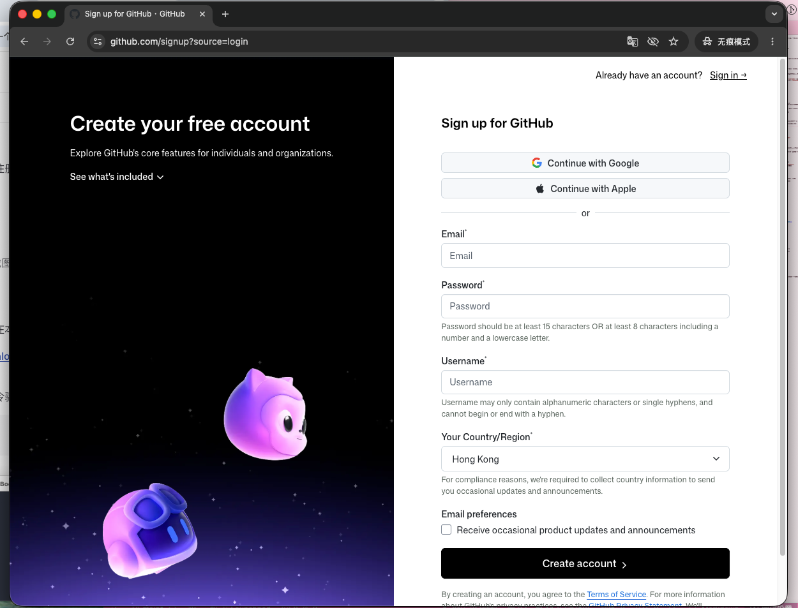
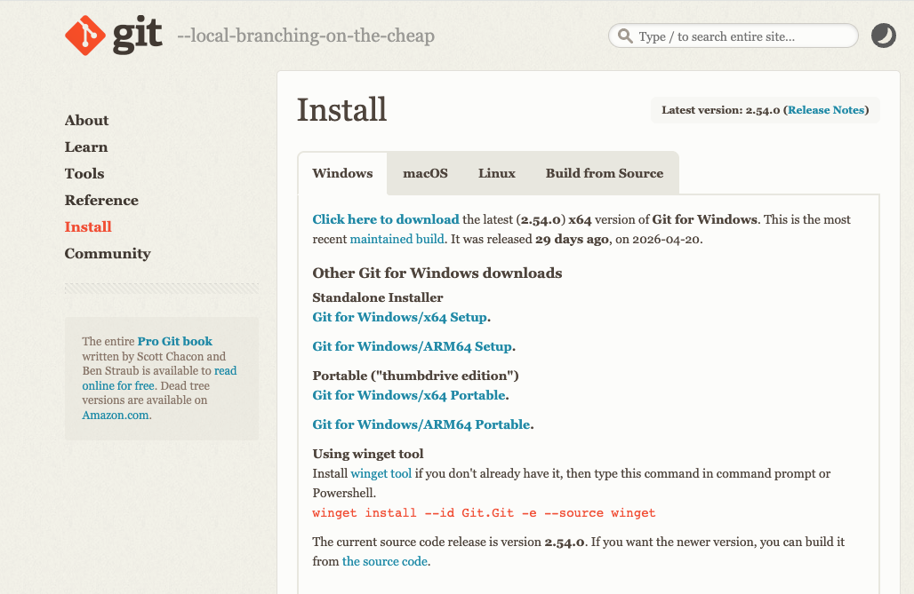
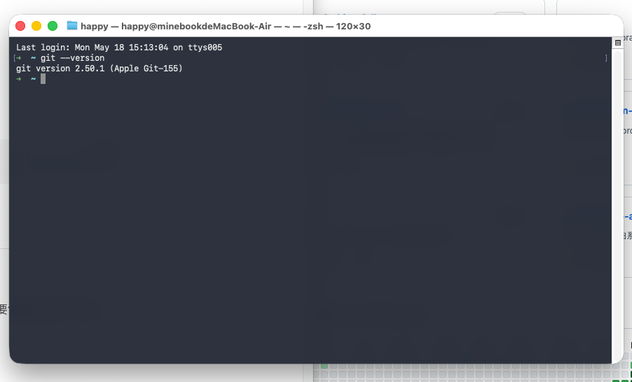
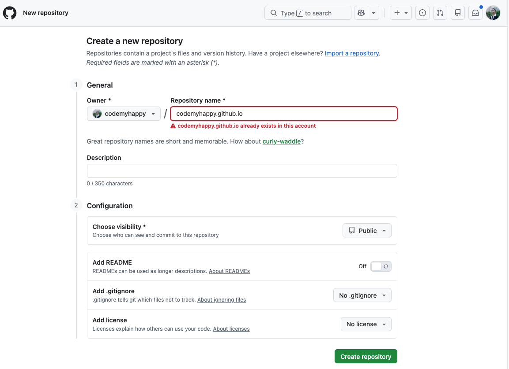
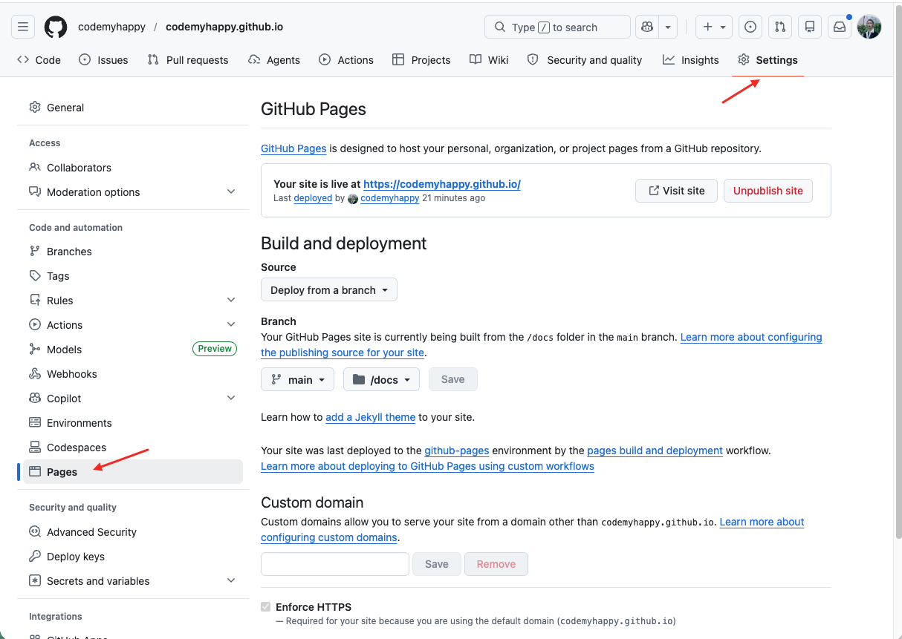
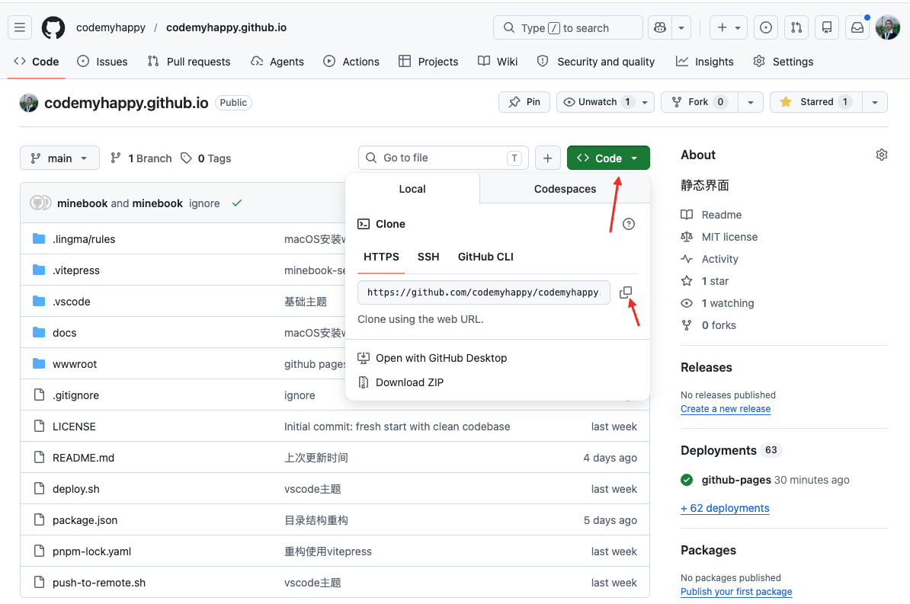
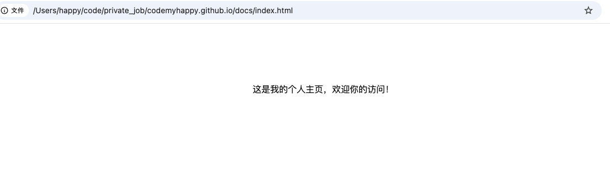
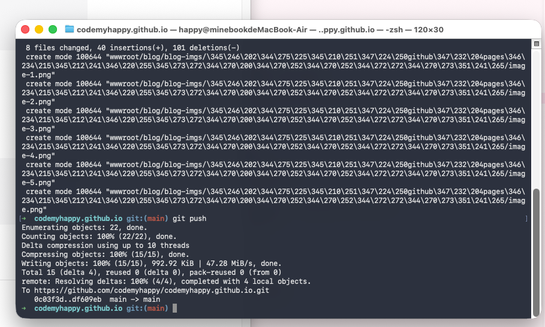
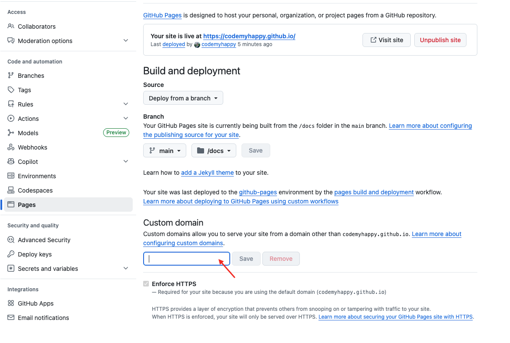
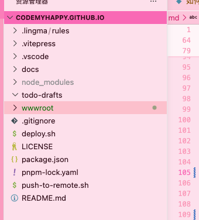

# 如何利用GitHub的Pages服务搭建个人网站

GitHub Pages是一个免费的静态网站托管服务，可以让你轻松地从GitHub仓库托管网站。本文将详细介绍如何使用GitHub Pages搭建一个个人主页。

## 准备工作

在开始之前，你需要完成以下准备工作：

### 1. 注册GitHub账号
如果你还没有GitHub账号，需要先注册一个：
- 访问 [https://github.com](https://github.com) 
- 点击"Sign up"按钮
- 按照提示填写必要信息完成注册



### 2. 安装Git工具
为了能够与GitHub交互，你还需要在本地安装Git：
- 访问 [https://git-scm.com/downloads](https://git-scm.com/downloads)
- 下载对应操作系统的版本




安装完成后，在终端运行以下命令验证：

```bash
git --version
```



## Step1、 创建个人主页仓库

GitHub Pages有两种类型的站点：项目站点和用户/组织站点。我们这里要创建的是用户站点。

### 1. 创建特殊命名的仓库
GitHub Pages用户站点需要一个特殊命名的仓库：
- 仓库名称必须是 `{username}.github.io`，其中`{username}`是你的GitHub用户名
- 例如，如果用户名是`codemyhappy`，那么仓库名应该是`codemyhappy.github.io`

### 2. 创建步骤
1. 登录GitHub账户
2. 点击右上角的"+"号，选择"New repository"
3. 在仓库名称框中输入 `{username}.github.io`
4. 选择"Public"（公共仓库）
5. 勾选"Add a README file"选项
6. 点击"Create repository"



## Step2、 配置GitHub Pages服务
1. 进入你刚刚创建的`{username}.github.io`仓库
2. 点击仓库顶部的"Settings"标签页
3. 向下滚动到"Pages"部分
4. 在"Source"下拉菜单中选择"Deploy from a branch"
5. 在分支选项中选择"main"分支，并在子目录中选择"/docs"（这样GitHub Pages会从docs文件夹部署网站）
6. 点击"Save"保存设置



配置完成后，GitHub会自动开始部署你的Pages站点，但目前内容是空白的。

## Step3、 添加内容到个人主页
### 1. 克隆自己的仓库到本地

先找到自己的仓库地址，复制到粘贴板。



然后随便找一个目录，例如我这里的`/Users/happy/code/private_job`，打开终端进入到这个目录。

最后执行命令即可：

```bash
git clone 你的仓库地址
```

### 2. 创建基本的HTML文件

克隆项目后，在仓库根目录下创建一个docs文件夹。

然后在其中创建一个简单页面`index.html`，内容如下:

```html
<!DOCTYPE html>
<html lang="zh-CN">
<head>
  <meta charset="UTF-8">
  <meta name="viewport" content="width=device-width, initial-scale=1.0">
  <title>我的个人主页</title>
</head>
<body style="text-align: center; padding-top: 100px;">
  这是我的个人主页，欢迎你的访问！
</body>
</html>
```

预览效果就一个行文字：



### 3. 提交文件到GitHub
1. 在本地仓库中创建docs目录
2. 将index.html文件放入docs目录
3. 提交更改：

```bash
git add . && git commit -m "初始化"
git push origin main
```



## 高级定制选项

### 1. 使用自定义域名
如果你想使用自己的域名而不是github.io的子域名：

1. 在DNS提供商处设置CNAME记录指向`{username}.github.io`
2. 在GitHub仓库的Settings > Pages部分添加自定义域名
3. 在仓库根目录创建CNAME文件，内容为你的域名



### 2. 自定义样式和功能
- 通过CSS自定义样式
- 使用JavaScript添加交互功能
- 引入第三方库和框架

比如，我们整一个粉色背景、大号字体的HTML文件：

```html
<!DOCTYPE html>
<html lang="zh-CN">
<head>
  <meta charset="UTF-8">
  <meta name="viewport" content="width=device-width, initial-scale=1.0">
  <title>我的个人主页</title>
  <style>
    body {
      background-color: pink;
      font-size: 32px;
      font-weight: bold;
    }
  </style>
</head>
<body style="text-align: center; padding-top: 100px;">
  这是我的个人主页，欢迎你的访问！
</body>
</html>
```


## 进阶：使用静态网站生成器

虽然我们可以直接编写HTML文件，但对于内容较多的网站，使用静态网站生成器会更方便。目前有很多静态网站生成器可以选择，比如Hugo、Gatsby、VuePress、VitePress等。

在这篇文章中，我们仅介绍了基础的手动创建方式。在下一篇文章中，我将详细介绍如何使用VitePress来搭建一个功能完善的个人博客系统，它更适合用来创建包含多篇文章的技术博客。

这是当前我这个博客的目录架构：



项目细节等我后续连载课程再给大家介绍。

懂一点的朋友，也可以直接克隆我的项目，开源的，直接拿去用就行了。

地址： [https://github.com/codemyhappy/codemyhappy.github.io](https://github.com/codemyhappy/codemyhappy.github.io)

## 总结

使用GitHub Pages搭建个人主页有以下优势：
- 免费且稳定
- 与GitHub无缝集成
- 支持自定义域名
- 可以使用各种静态网站生成器
- 适合开发者展示项目和技能

现在你已经了解了如何使用GitHub Pages搭建个人主页的全过程。

在下一篇文章中，我将详细介绍如何使用VitePress来创建一个功能丰富的技术博客。

感兴趣的朋友可以去我的社交主页，关注我，一起学习。