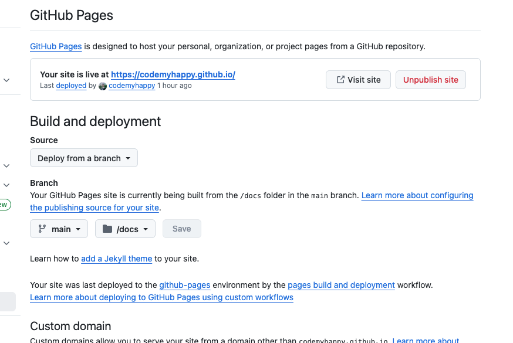
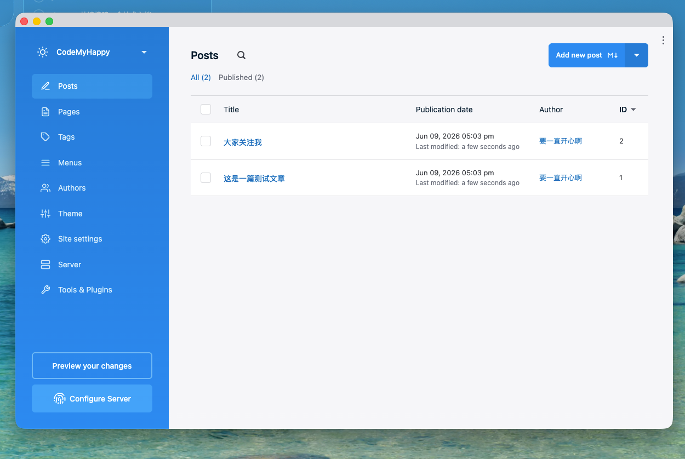
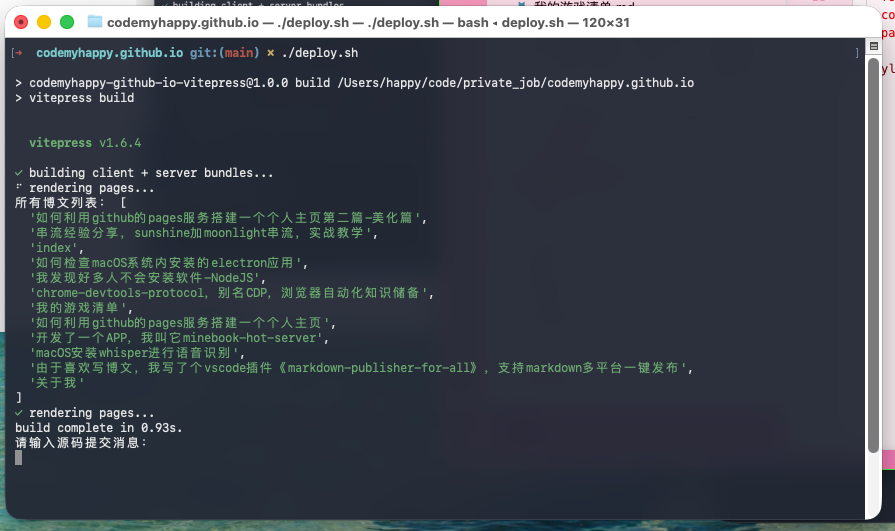

# 如何利用github的pages服务搭建一个个人主页-第二篇-美化篇

在[上一篇文章](如何利用github的pages服务搭建一个个人主页.md)中，我们介绍了如何使用GitHub Pages搭建一个最简单的个人主页，但那个主页确实比较简陋，没有太多内容，没有美化、没有导航栏、大纲、没有自动化构建。今天我们来聊聊如何让我们的个人主页变得更美观、更实用。

## 回顾：开启GitHub Pages服务

还记得吗？在上篇中，我们通过以下步骤开启了GitHub Pages服务：
1. 创建了名为 `{username}.github.io` 的特殊仓库
2. 在仓库的 Settings > Pages 中配置了部署源
3. 将内容放在 `/docs` 目录下进行部署



## 美化方案

对于美化个人主页，我这里推荐两种方案：

### 小白方案-基于Publii

Publii 是一款免费的桌面应用程序，专为创建静态网站而设计。它具有直观的界面和强大的功能，即使没有编码经验的人也能轻松使用。

**优点：**
- 可视化编辑器，像编辑Word文档一样简单
- 预设的主题模板
- 无需代码知识

**缺点：**
- 功能相对有限
- 定制化程度不如手写代码高



### 折腾方案-基于VitePress


这正是我现在使用的方式，也是我个人推荐的方案。VitePress 是一个极简的静态站点生成器，由 Vue.js 和 Vite 驱动。

我已将我的个人主页开源，你可以直接使用我的模板，详情请查看项目 README：

地址：[https://github.com/codemyhappy/codemyhappy.github.io](https://github.com/codemyhappy/codemyhappy.github.io)

#### 基本使用方法

> 需要下载[Node.js](https://nodejs.org/en/) 和[git客户端](https://git-scm.com/)
> 
> 两个工具的安装都是傻瓜式的，请自行安装


1. **克隆我的项目**
   ```bash
   git clone https://github.com/codemyhappy/codemyhappy.github.io.git
   cd codemyhappy.github.io
   ```

2. **安装依赖**（需要先安装pnpm）
   ```bash
   npm install -g pnpm
   pnpm install
   ```

3. **启动开发服务器**
   ```bash
   pnpm dev
   ```
   然后访问 `http://localhost:9002` 查看效果

4. **更换远程仓库地址**
   ```bash
   # 删除原始的远程仓库地址
   git remote remove origin
   
   # 添加你自己的仓库地址 (将 {your_username} 替换为你的 GitHub 用户名)
   git remote add origin https://github.com/{your_username}/{your_username}.github.io.git
   ```

5. **推送代码到你的仓库**
   ```bash
   # 推送 main 分支
   git push -u origin main
   ```

部署过程中会自动生成静态文件，并推送到GitHub Pages。



#### 项目目录结构

```
.
├── .vitepress/             # VitePress 配置目录
├── wwwroot/                # 源代码目录 (VitePress 源文件)
│   ├── blog/               # 博客文章目录
│   │   ├── index.md        # 博客首页
│   │   └── 文章文件...
│   ├── index.md            # 首页
│   └── public/             # 静态资源目录
├── docs/                   # 构建输出目录 (GitHub Pages 部署目录)
├── todo-drafts/            # 待发布文章草稿
├── components/             # 博客组件目录
├── deploy.sh               # 自动化部署脚本
├── push-to-remote.sh       # 仅推送到远程仓库，不发版
├── package.json            # 项目配置和脚本
└── README.md               # 项目说明
```

具体的开发流程、更多脚本命令和部署方式，请参阅项目根目录的 README.md 文件，里面有详细的说明。

## 总结

静态网站生成器有很多，如Hexo、Jekyll、Hugo、Astro，等等。

但我这个项目基于Vitepress在背后做了许多的工作，比如自动生成目录、自动生成侧边栏、自动生成导航栏等等。

当然，如果你只是想要一个非常简单的页面，使用纯HTML/CSS也是可以的。选择哪种方案取决于你的需求和技术水平。


## 最后预告一下

这篇文章是github搭建静态主页，系列文章的第二篇，下一篇文章我计划新增评论功能和图片放大功能。

希望这篇文章能帮助你搭建出一个满意的个人主页！如果你有任何问题，欢迎在评论区交流。
