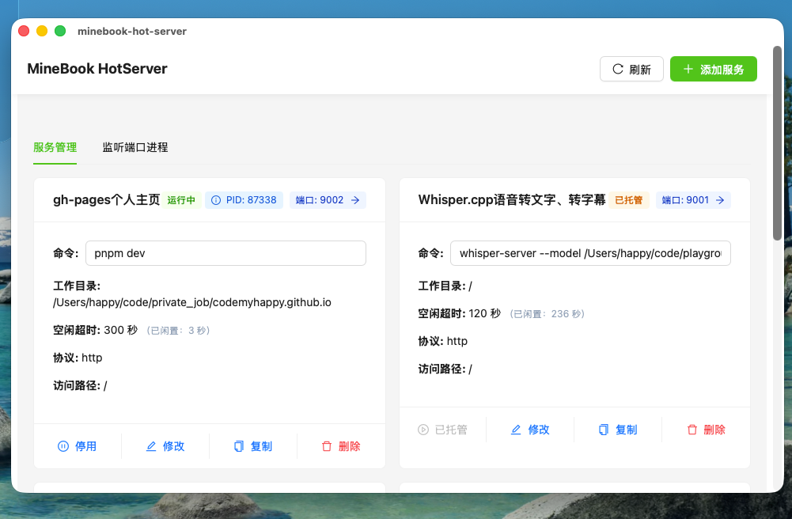
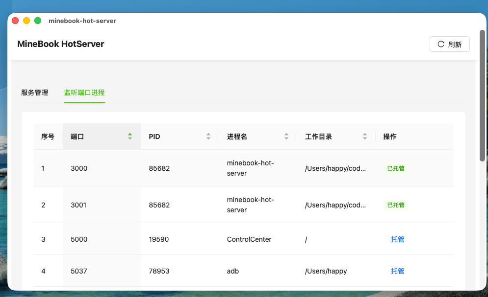

# MineBook Hot Server：个人开发的本地服务智能管理工具

**MineBook Hot Server** 是我个人开发的一款用于管理本地开发服务的自动化工具，用于智能监控和管理本地端口，有效减少不必要的系统资源占用。

## 背景与需求

在我日常的开发工作中，我遇到了一些痛点：

- 本地服务端口被占用时，我很难快速定位是哪个进程在运行
- 偶尔启动的服务在使用完毕后，我经常会忘记手动关闭
- 这些未关闭的服务导致我的电脑内存压力一直很高
- 长期下来，我的 MacBook 就会因为内存不足而变得卡顿
- 当内存不足时，MacBook 会启用虚拟内存，将硬盘作为交换空间，这样会影响硬盘寿命

我相信其他开发者也可能面临类似的困扰。

## 个人解决方案

基于上述的痛点，作为一个程序员，当然是写个APP来解决咯~

于是，我设计并开发了 **MineBook Hot Server** 来解决我自己遇到的这些问题。

该工具基于 Tauri 构建，采用 Rust 作为后端语言，前端使用 Web 技术实现。核心技术方案如下：

- 后台轮询监听端口流量：系统定期扫描指定端口的流量情况
- 活跃度判断：通过检测端口流量变化来判断服务是否处于活跃状态
- 智能关闭：如果端口在设定时间内（如30秒）没有流量变化，则判定为不活跃
- 进程管理：对不活跃的端口进行 PID 反查，并自动发送终止命令

## 界面一览

### 主页

主页目前提供了基本上所有的功能：
- 添加服务：添加新的服务，并保存配置
- 修改服务：修改已添加的服务配置
- 删除服务：删除已添加的服务
- 启动服务：点击端口号即可启动已添加的服务
- 停止服务：停止已添加的服务
- 复制服务：复制服务启动命令，方便快速创建新的服务端口代理
- 端口详情：查看服务详情，包括启动命令、端口号、服务状态、服务创建时间、闲置时间、运行状态、进程ID（PID）

### 添加服务弹窗

弹窗比较简单，输入必备的服务信息，点击"创建服务"按钮即可完成服务添加。

### 监听端口进程

这个页面是一个端口的快速查看页面，能查看当前系统中已经启动的端口服务。

也能看到哪些端口已经被minebook-hot-server托管，

未托管的端口，可以点击”托管“按钮，快速的完成端口托管。

### 后台日志页

这是一个后台的日志，如果遇到问题可以快速定位。

对于非开发人员估计用不上。

## 个人开发总结

**MineBook Hot Server** 是我独立设计和实现的项目。从概念设计到功能实现，再到实际部署，整个项目完全由我个人完成。经过一段时间的实际使用验证，该工具在以下方面表现出色：

- 有效控制内存占用
- 清晰展示当前活跃的本地端口信息
- 基于 RUST开发，保证了系统的稳定性

如果你也常常为本地服务管理而烦恼，不妨关注我的技术分享，了解这款工具的最新进展。我正在持续优化中，未来版本将增加更多实用功能。欢迎试用并提出宝贵意见，帮助我进一步完善这个工具！