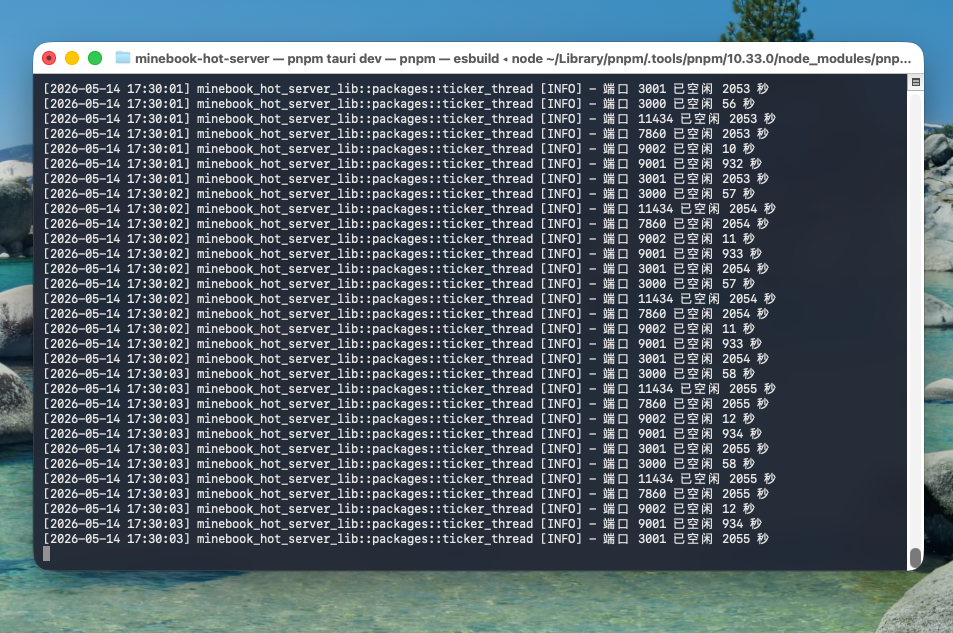

# MineBook Hot Server：个人开发的本地服务智能管理工具

**MineBook Hot Server** 是我个人开发的一款用于管理本地开发服务的自动化工具，用于智能监控和管理本地端口，有效减少不必要的系统资源占用。

## 背景与需求

在我日常的开发工作中，我遇到了一些痛点：

- 本地服务端口被占用时，我很难快速定位是哪个进程在运行
- 偶尔启动的服务在使用完毕后，我经常会忘记手动关闭
- 这些未关闭的服务导致我的电脑内存压力一直很高
- 长期下来，我的 MacBook 就会因为内存不足而变得卡顿
- 当内存不足时，MacBook 会启用虚拟内存，将硬盘作为交换空间，这样会影响硬盘寿命

我相信其他开发者也可能面临类似的困扰。

## 个人解决方案

作为独立开发者，我设计并开发了 **MineBook Hot Server** 来解决我自己遇到的这些问题：

- 智能管理系统资源分配，确保充足可用内存
- 优化系统性能，专注当前任务处理
- 预防系统卡顿，提升开发体验

## 技术实现方案

该工具基于 Tauri 构建，采用 Rust 作为后端语言，前端使用 Web 技术实现。核心技术方案如下：

- 后台轮询监听端口流量：系统定期扫描指定端口的流量情况
- 活跃度判断：通过检测端口流量变化来判断服务是否处于活跃状态
- 智能关闭：如果端口在设定时间内（如30秒）没有流量变化，则判定为不活跃
- 进程管理：对不活跃的端口进行 PID 反查，并自动发送终止命令

## 核心功能实现

### 传统方式对比

我之前在开发时，通常会通过命令行启动多个端口服务（例如 8888 和 9999 端口），但这种方式让我感到不便：

- 需要频繁打开终端控制台
- 服务生命周期完全依赖手动管理，我经常忘记关闭这些服务
- 长期运行的服务持续占用内存资源

### 项目工作流程

为了解决我的这个问题，我在该工具中实现了图形化界面，简化了我的服务管理流程：

1. 通过 **MineBook Server App** 点击"添加服务"
2. 配置启动命令及相关参数
3. 保存配置后应用自动托管对应端口
4. 我可以直接通过界面访问服务，无需操作控制台

### 智能闲置管理算法

针对我自己的使用习惯，系统具备自动检测功能：

- 实时监测端口流量以判断服务活跃状态
- 根据预设策略自动关闭我不再使用的端口
- 例如，9999 端口在我连续 30 秒没有访问后会自动关闭

## 个人开发总结

**MineBook Hot Server** 是我独立设计和实现的项目。从概念设计到功能实现，再到实际部署，整个项目完全由我个人完成。经过一段时间的实际使用验证，该工具在以下方面表现出色：

- 有效控制内存占用
- 清晰展示当前活跃的本地端口信息
- 基于 RAS 架构，保证了系统的稳定性

如果你也常常为本地服务管理而烦恼，不妨关注我的技术分享，了解这款工具的最新进展。我正在持续优化中，未来版本将增加更多实用功能。欢迎试用并提出宝贵意见，帮助我进一步完善这个工具！