我发现好多人不会安装软件-NodeJS.md
# 我发现好多人不会安装软件-Node.JS

最近发现好多新手朋友对如何安装 Node.js 感到困惑。其实安装 Node.js 并不复杂，这篇文章就教大家最简单的方法。

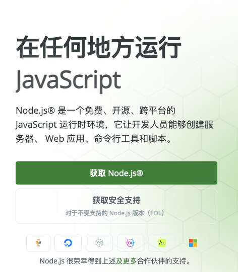

## 什么是 Node.js？

简单来说，Node.js 就是让你能在电脑上运行 JavaScript 的环境。无论你是想做前端开发，还是后端服务，或者是最近很火的AI工具，它都是必不可少的前置工具。

## 最简单的安装方法

访问 Node.js 官方下载页面：[https://nodejs.org/zh-cn/download](https://nodejs.org/zh-cn/download)

根据你的操作系统下载对应的安装包：

上面的nvm、pnpm等内容，都是可选的，没必要装，徒增复杂度。

## Windows 系统安装步骤

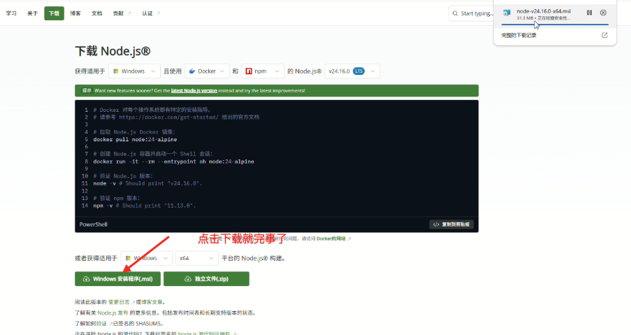

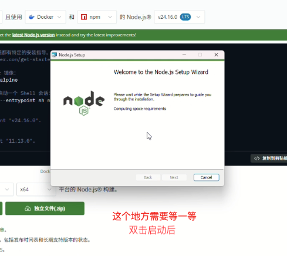

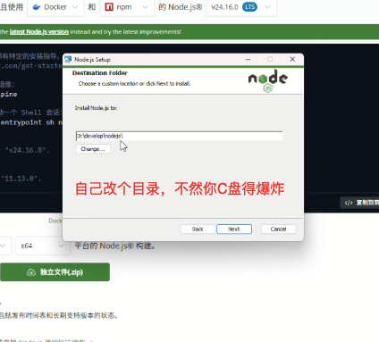

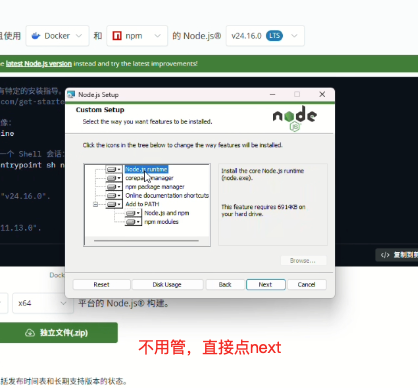

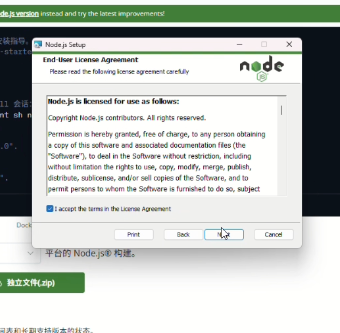

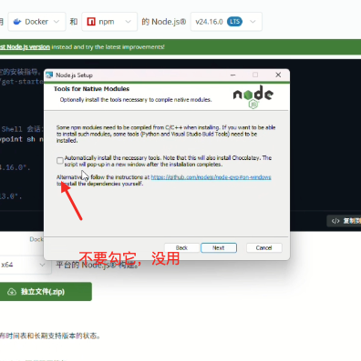

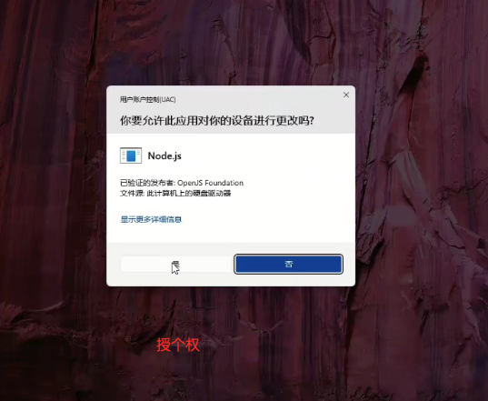

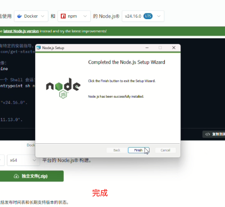

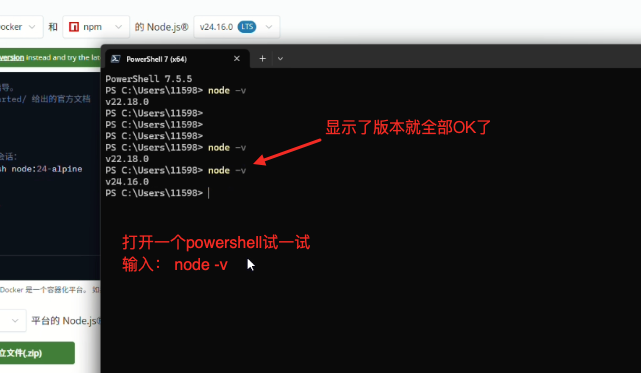

## Mac 系统安装步骤

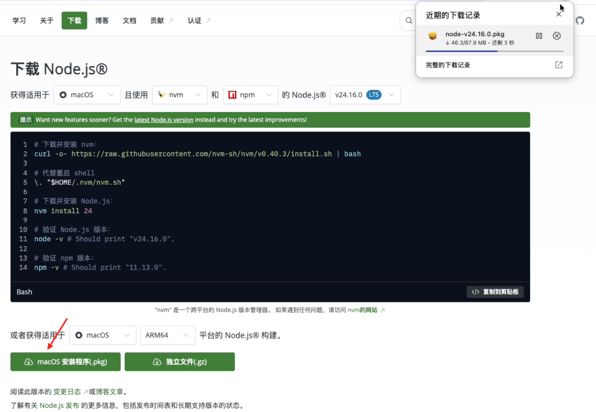

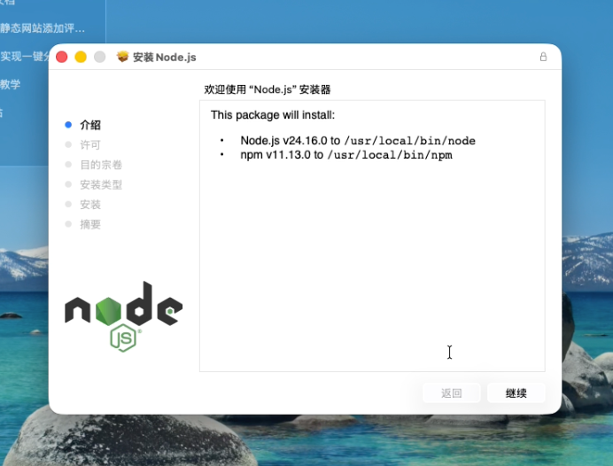

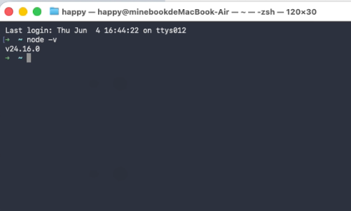

macOS的安装非常简单，一直按提示操作，安装完成后，在终端输入 node -v 命令，如果显示版本号，则安装成功。

## 常见问题

**Q: 安装后命令行显示 "node 不是内部或外部命令"？**
A: 这通常是因为没有正确设置环境变量。请重新安装，在安装时确保勾选了 "Add to PATH" 选项。

**Q: 该选择哪个版本？**
A: 新手请选择 LTS 版本，这是稳定版，更适合学习使用。

**Q: Mac安装遇到权限问题怎么办？**
A: 在安装过程中可能需要输入管理员密码，这是正常现象，输入密码即可继续安装。

## 总结

安装 Node.js 就这么简单！记住选择 LTS 版本，按照对应系统的安装步骤操作，最后验证一下即可。Node.js 是前端开发的重要工具，掌握了它的安装，你就迈出了开发的第一步！