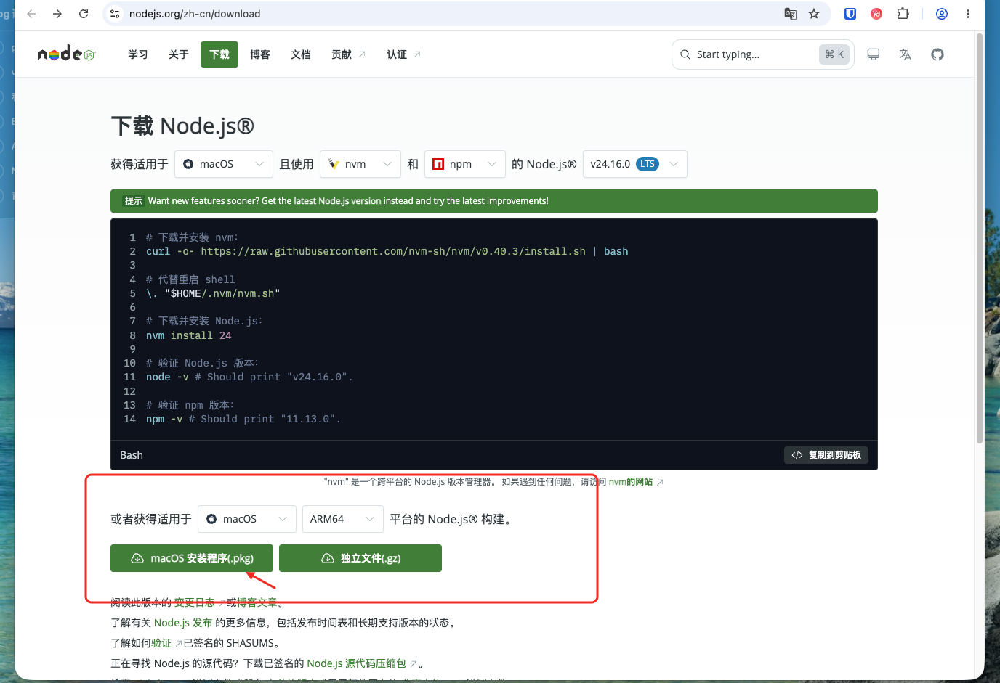

我发现好多人不会安装软件-NodeJS.md
# 我发现好多人不会安装软件-Node.JS

最近发现好多新手朋友对如何安装 Node.js 感到困惑。其实安装 Node.js 并不复杂，这篇文章就教大家最简单的方法。

## 什么是 Node.js？

简单来说，Node.js 就是让你能在电脑上运行 JavaScript 的环境。无论你是想做前端开发，还是后端服务，或者是最近很火的AI工具，它都是必不可少的前置工具。

## 最简单的安装方法

### 第一步：下载安装包

访问 Node.js 官方下载页面：[https://nodejs.org/zh-cn/download](https://nodejs.org/zh-cn/download)

根据你的操作系统下载对应的安装包：



上面的nvm、pnpm等内容，都是可选的，没必要装，徒增复杂度。

### 第二步：运行安装程序

#### Windows系统安装步骤：

1. 下载 `.msi` 文件（Windows Installer）
2. 双击下载的安装包开始安装
3. 一路点击 "Next" 或 "下一步"
4. 在选择组件界面，保持默认选项（确保勾选 "Add to PATH"）
5. 选择安装路径（建议使用默认路径）
6. 继续点击 "Next" 直到安装完成

> 提示：此处需要添加Windows安装过程截图

#### Mac系统安装步骤：

1. 下载 `.pkg` 文件（Mac Installer）
2. 双击下载的安装包开始安装
3. 按照安装向导提示操作
4. 可能需要输入管理员密码
5. 完成安装后，Node.js 会自动添加到系统路径中

> 提示：此处需要添加Mac安装过程截图

### 第三步：验证安装

安装完成后，打开对应系统的命令行工具：

**Windows用户**：按 Win+R 输入 `cmd` 或搜索"命令提示符"

**Mac用户**：打开"终端"应用（Terminal）

输入以下命令检查是否安装成功：

```bash
node --version
npm --version
```

如果看到版本号输出，恭喜你！Node.js 已经成功安装了。

> 提示：此处需要添加命令行验证截图

## 常见问题

**Q: 安装后命令行显示 "node 不是内部或外部命令"？**
A: 这通常是因为没有正确设置环境变量。请重新安装，在安装时确保勾选了 "Add to PATH" 选项。

**Q: 该选择哪个版本？**
A: 新手请选择 LTS 版本，这是稳定版，更适合学习使用。

**Q: Mac安装遇到权限问题怎么办？**
A: 在安装过程中可能需要输入管理员密码，这是正常现象，输入密码即可继续安装。

## 总结

安装 Node.js 就这么简单！记住选择 LTS 版本，按照对应系统的安装步骤操作，最后验证一下即可。Node.js 是前端开发的重要工具，掌握了它的安装，你就迈出了开发的第一步！