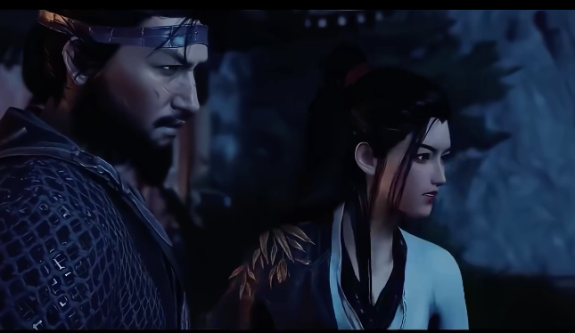
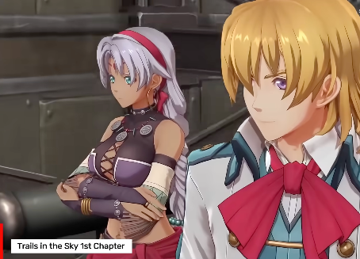
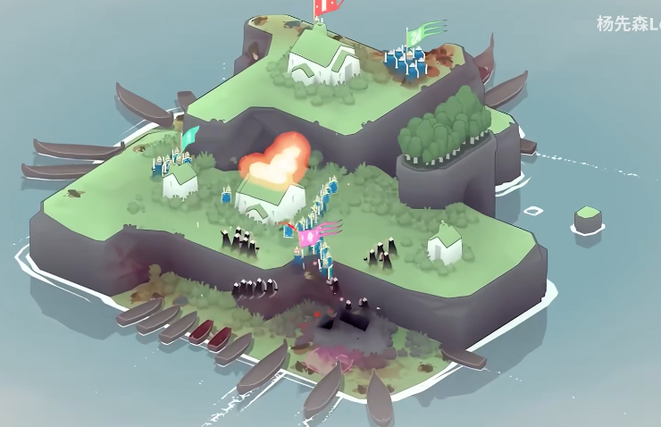
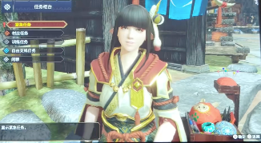

# 我的游戏清单

整理一下我喜欢的游戏，标注是否已玩过。

## 主要游玩设备

- 联想平板 Y700
- 苹果手机 14 Plus
- MacBook Air M5
- Win笔记本 小米14

## 游戏列表

### 《DNF》[已玩]
> 提示：此处需要添加游戏截图

玩了很多年，每次登录都有熟悉的感觉，刷图的时候很放松。

但太费钱了，没好武器图都过不了，后弃坑。

### 《王者荣耀》[已玩]
> 提示：此处需要添加游戏截图

和朋友开黑必备，有时候一局能玩很久，挺上头的。

一分不氪玩了很多年了。

### 《阴阳师》[已玩]
> 提示：此处需要添加游戏截图

画面确实好看，抽卡有点费钱，不过剧情还挺有意思的。

后续版本出得太快，英雄/式神出得太快，就不玩了。

### 《微信小游戏：别踩白块》[已玩]（我自己做的微信小游戏）
> 提示：此处需要添加游戏截图

自己动手做的小游戏，虽然简单，但看着自己作品上线还是挺有成就感的。

### 《塞尔达传说：旷野之息》 [已玩]
> 提示：此处需要添加游戏截图

这个游戏让我愿意慢慢玩，到处探索，没有任务压力，很享受。

还有很多花活操作：风弹、飞雷神、盾反炸弹、盾反炸弹二段跳、破冰起飞 ...

学会一个风弹，就是另一种游戏体验了。

### 《塞尔达传说：王国之泪》 [已玩]
> 提示：此处需要添加游戏截图

个人感觉没旷野之息好玩，画风暗黑、潮湿、破败，某些怪物恶心，没有旷野之息生机勃勃的感觉。

但王国之泪可以玩建造diy，综合来看，也算好玩。

### 《动物森友会》 [已玩]
> 提示：此处需要添加游戏截图

个人感觉很轻松，主要是画风可爱，不需要复杂操作。

计划给小孩子玩玩。

### 《马里奥赛车8》 [已玩]
> 提示：此处需要添加游戏截图

陪家里孩子玩的，卡通画风，赛道新奇，非常推荐给孩子玩。

## 想玩的游戏

### 《燕云十六京》

据说是古风类的开放世界，抽空体验一下

### 《pico park2》

### 《空之轨迹》

画风挺喜欢的，还没空玩

### 《迷雾北境》

依然是画风挺喜欢

## 不适合我的游戏

### 《刺客信条》
> 提示：此处需要添加游戏截图

太写实了，但又没完全真实，自由度也没那么高。

默认设置的视角转动太快，容易晕，不想花时间设置。

### 《马里奥奥德赛》
> 提示：此处需要添加游戏截图

可能是手柄的原因，不适合我的手柄。

只能一个人玩，另一个人只能当帽子。

对于小孩子来说操作比较复杂，对于我来说，画风又过于低龄。

### 《怪物猎人 崛起》

不喜欢这种页游风。

---
这份清单会持续更新，记录那些给我带来快乐的游戏时光。